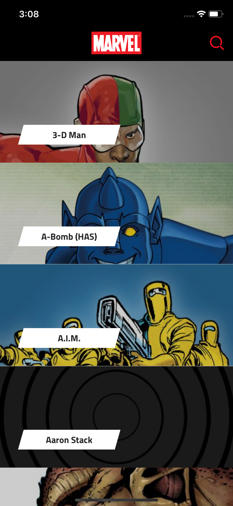
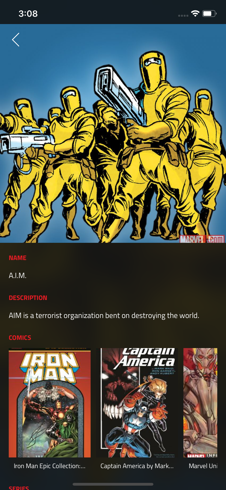
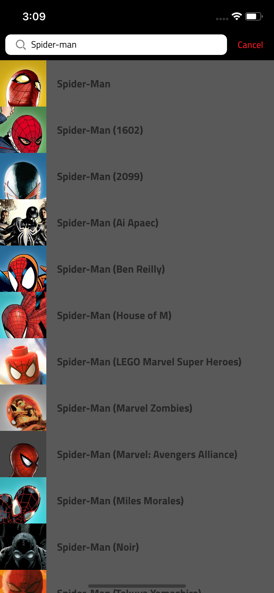

# Marvel Heros
The perfect wiki for Marvel diehards to check which comics and series each character was in.

## Screenshots
Home Screen                |  Details Screen           |  Search Screen
:-------------------------:|:-------------------------:|:-------------------------:
  |    |  

## Features
* All views were built programatically without the use of a single storyboard.
* Built arount the concepts of reactive programming (RxSwift, RxCocoa).
* Features a modular design with high testability and maintainability.

## Architecture
This app was built using a modular version of MVVM.

### Modules
* **Common**: Holds all the common code that is used by all of the project.
* **MHCore**: Holds the dependency containers and coordinators for the project.
* **MarvelHerosKit**: Holds all the business logic, networking part of the project.
* **HerosList**: Holds the UI part of the app.

## Author
Mario Mouris, marioamgad9@gmail.com
